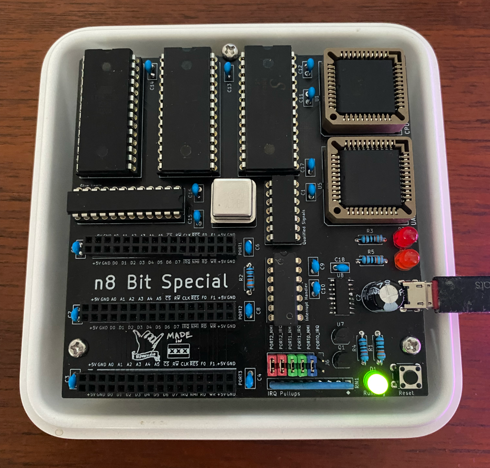
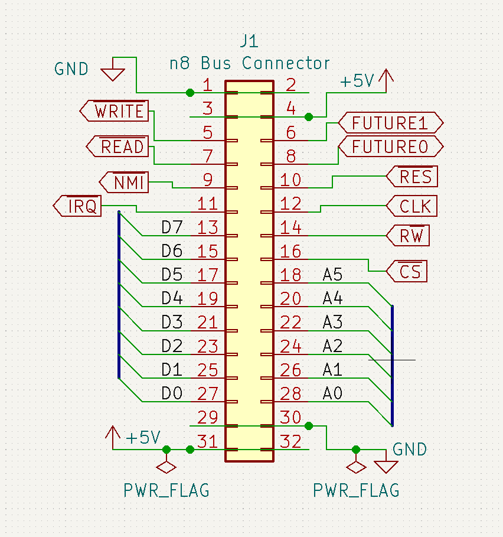

# n8 Bit Microcomputer

The n8 Bit Microcomputer is a homebrew breadboard computer built around a WDC65C02 8-bit CPU.
If you are looking for the software that runs on this computer, check out [LmaOS](https://github.com/nrivard/lmaos).

## History

The n8 Bit was originally a breadboard computer based on the [Ben Eater series of 6502 videos](https://www.youtube.com/playlist?list=PLowKtXNTBypFbtuVMUVXNR0z1mu7dp7eH) but with some added capabilities including ACIA support, GAL-based address decoding logic, and a power chip for more reliable reset and power-on.
Since then, PCBs have been printed and development around the computer is based on these.

## Physical Design

Large PCBs are expensive and I am not a rich person.
For this reason, the main goal of the physical design of this computer and the expansion cards is to fit on the $5 boards at the cheap PCB houses.
This gives a maximum area of 100mm x 100mm, which this board attempts to utilize to the utmost.

## Main Board

The v2 main board is built around a WDC65C02 CPU operating at 3.6864Mhz and is meant to be as minimally viable as possible. It consists of:

* 3 memory sockets (AT28C256/CY62256 footprint) for a configurable mix of RAM and/or ROM
* SC28L92 DUART for serial communication and built-in timer(s)
* CH340 USB-to-serial chip
* Micro USB port for power (D+/D- are connected to the CH340)
* GAL22V10 for flexible address decoding
* Crystal oscillator can for stable clock generation
* 74HC21 for multi-device IRQ and handling (supports older open-collector devices with jumpers on built-in pull-up resistors)
* DS1813 for reset and power-on circuitry
* 3 n8 Bus ports for I/O

### Changes from v1

* Moved from 4 n8 Bus ports down to 3. This was mainly for space reasons and one of the previous ports was always dedicated to serial communication and a VIA for a timer. By moving both of these onto the board, we can give some more breathing room to 3 expansion ports instead
* Moved to half-size oscillator can and increased speed to 3.6864 MHz. The DUART runs at this frequency so I made this the main clock as well.
* Moved to PLCC-44 packaging for CPU and DUART. This not only looks cooler but it has a smaller footprint and allowed me more room to lay out additional components.
* Added transistor stage to the "running" light so it shows when it's actually running, not just when there is power to the board. Pressing and holding RESET will drive this LED off while RESET is low.
* Added qualified (ANDed with CLK) read and write signals to the board and to the n8 Bus ports, replacing D+/D-.
* Ran CLK into the GAL in case I want to use itsignal to qualify future signals.
* Moved from 2 layer to 4 layer board. So many signals! Also, this is auto-routed, I don't care, I'm not a purist in this (one) sense

## Address space

By default, the n8 Bit is intended to have the following memory hardware:

* 1 Atmel AT28C256 in the ROM1 socket
* 2 Cypress CY62256NL in the RAM1 and RAM2 sockets

### Default Memory Layout

If you are using the default hardware and the included GAL code, it has the following memory layout:

| Device | Address Range |
|--------|---------------|
| Zero Page | `$0000...$00FF` |
| Stack | `$0100...$01FF` |
| RAM | `$0200...$BEFF` |
| Port 0 | `$BF00...$BF3F` |
| Port 1 | `$BF40...$BF7F` |
| Port 2 | `$BF80...$BFBF` |
| DUART | `$BFC0...$BFFF` |
| ROM | `$C000...$FFFF` |

This configuration has 16K of ROM, 48k (less one page) of RAM, and 1 page of memory (`$BF00...$BFFF`) dedicated to 3 I/O ports and the DUART, each of which has 64 addressable memory locations.

### Customizing the Address Space

Because address decoding is entirely GAL based, you have a lot of room to customize the address space.
The GAL itself has physical connections to each port and to each memory socket for CS signals. How you utilize these (or even _if_ you utilize them) is entirely up to you.
If you wanted a simpler computer (like the Ben Eater computer) you may opt to leave one memory socket open and only use a single RAM and a single ROM chip.
If you go this route, you will have to update your own GAL code to match your hardware configuration.

## n8 Bus

The biggest advancement with the n8 Bit when it moved from breadboards to custom PCBs is the introduction of the n8 Bus spec.

The spec mandates that the following signals will be available on a standard 2x16 board-to-board female header:

**Bidirectional signals:**

* all 8 bits of the data bus

**Read-only signals:**

* bottom 6 bits of the address bus
* per-port dedicated CS signal
* CPU's R/W signal
* READ signal qualified with high part of the CLK
* WRITE signal qualified with high part of the CLK
* CLK
* RESET

**Write-only signals:**

* per-port NMI
* per-port IRQ

**Expansion signals:**

The n8 Bus spec includes 2 lines (`FUTURE0` and `FUTURE1`) that don't currently have a purpose.
These are hooked up to 2 I/O pins of the GAL and are intended for you to customize them.
For example, if you have a VDP that outputs a colorburst clock that you want to use to drive a sound adapter, you can route that signal through one of these pins.

**Power Rails:**

The n8 Bus spec provides power rails (+5V and ground) on both the top and bottom of the header for shorter, more convenient power routing on your expansions cards.

## I/O Expansion Cards

The main board for this computer is intentionally minimal.
This means that all of your I/O functionality beyond a DUART (VIA, display, sound, etc.) has to come in the form of an expansion card that sits in a n8 Bus port.

### Reference Cards

Two highly utilized devices that many hobbyists want to include on a homebrew computer are a UART (this is unnecessary now on the v2 board but is kept for reference purposes) and a GPIO device.
In this repo, 2 such reference designs are included:

* a UART card based on the Rockwell 65C51, called Kids Serial
* a GPIO (and other functions) card based on the WDC65C22S, called Viaduct

### Custom Cards

If you want to create your own cards, it's best to copy one of the existing reference designs first.
This is because they will already have:

* the n8 Bus port with proper pin directionality _for the card_ in the schematic
* a standardized PCB footprint
* some device footprints (like the 2x16 right-angle male pin header) set

This will ensure you have consistent and correct card designs from the start.

## Interrupts

NMI and IRQ are supported for all 3 n8 Bus ports.
This board uses a WDC65C02 which uses a totem-pole design (the NMOS 6502 used an open-drain design) and so the board also includes optional jumpers for pull-up resistors. In general:

* if your device is open-drain (older 6551s) or your device does not support interrupts at all, you will need to **_add_** jumpers across the interrupt lines for that port
* if your device is totem-pole (WDC65C22S), you will want to **_remove_** the jumpers as the pull-up resistor will slow down signal change

See [this article from Garth Wilson](http://wilsonminesco.com/6502primer/IRQconx.html) for more information.

## Known Bugs

There are no known hardware bugs with the v2 board.
If you find one (or more) please raise an issue.